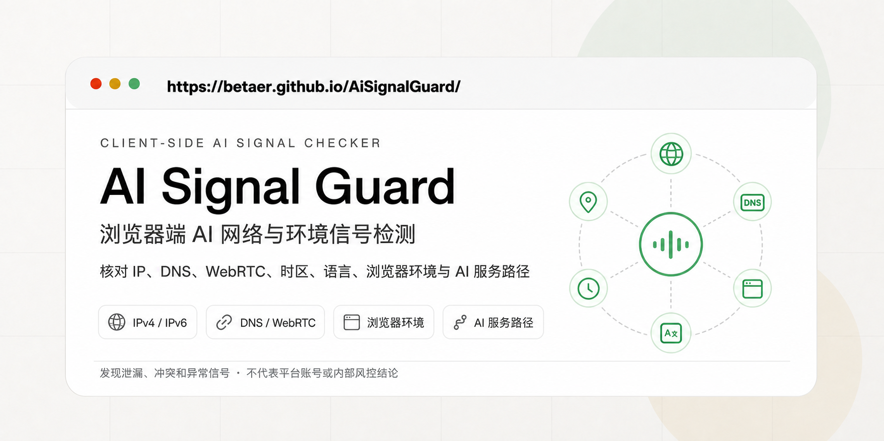

# AI Signal Guard

[简体中文](README.md) · [English](docs/readme-en.md)

浏览器端网络与数字身份信号诊断工具，通过多源证据核验 **IP、DNS、WebRTC、浏览器环境和 AI 服务连通性**，并明确区分事实、推断、失败与未知状态。

[在线检测](https://betaer.github.io/AiSignalGuard/) · [提交问题](https://github.com/betaer/AiSignalGuard/issues/new/choose) · [查看源码](https://github.com/betaer/AiSignalGuard)



AI Signal Guard 不判断访问者的真实国籍、职业或个人身份，也不承诺账号解锁或规避平台风控。它回答的是：**当前浏览器向不同网络端点暴露了哪些信号，这些信号是否一致，以及证据是否足够。**

## 核心优势

- **多源而非单源**：IP 情报、路由注册、WebRTC 与 STUN 分别保留来源级状态和证据。
- **失败不冒充安全**：超时、字段缺失和请求失败保持“失败 / 未知”，不参与安全票。
- **结论可追溯**：摘要、评分、正反原因均可回到对应来源和原始检测模块。
- **边界明确**：区分浏览器本地计算、第三方网络请求、启发式推断和无法验证的业务状态。

## 核心能力

| 模块 | 检查内容 | 输出用途 |
|---|---|---|
| 出口 IP | IPv4 / IPv6、国家与地区、ASN、组织、网络类型、多源冲突 | 理解不同地址族和不同目标看到的出口 |
| DNS 泄漏 | 标准与深度 DNS 检测、解析器归属 | 判断 DNS 是否跟随预期网络路径 |
| WebRTC | 主检测池公网候选、补充 STUN 节点证据、mDNS / 内网地址分类 | 发现浏览器候选地址与 HTTP 出口差异 |
| 路由与注册 | IANA、RIR、RIS、WHOIS、Cymru、PeeringDB 等来源 | 交叉核对 ASN、前缀和注册组织 |
| 环境一致性 | 浏览器语言、系统时区、Emoji、中文字体和设备公开信息 | 发现地理、语言、时区和浏览器信号之间的明显矛盾 |
| 浏览器指纹 | Canvas、本地摘要、屏幕、平台、逻辑线程、内存估计、WebAudio | 查看网页脚本在当前浏览器能读取或计算的暴露面 |
| 服务连通 | AI、内容、商业、开发者、全球与中国站点 | 判断本次浏览器请求路径是否取得响应 |
| AI 路径与状态 | 目标站视角的来源标签、接入节点、官方状态接口 | 区分网络路径问题与平台公开故障信息 |
| 身份画像 | 动态权重、置信度、覆盖率、关键差异上限 | 比较当前环境与选定数字场景的相似程度 |
| 报告与分享 | 默认脱敏的 Markdown 报告、短摘要 | 便于人工复核或自行粘贴给 AI 分析 |

## 多源证据架构

### 确定性的来源注册表

当前 v2 在启动时校验以下来源池数量和唯一性：

| 证据池 | 数量 | 调度方式 |
|---|---:|---|
| IP 情报来源 | 10 家 / 每个可用地址族 | IPv4、IPv6 分开查询与汇总 |
| 路由与注册来源 | 10 路 / 每个可用地址族 | 对应地址族形成 ASN 共识后启动 |
| WebRTC 主检测池 | 10 个独立节点 | 每个节点使用独立 `RTCPeerConnection` |
| 补充 STUN 池 | 10 个独立节点 | 不复用主池候选，独立保留终态 |

两组 WebRTC / STUN 池合计 20 次节点尝试，但文档和界面按“主池 10 + 补充池 10”分别展示，避免把不同角色的证据混成一个夸大的节点数字。

### 只让有效证据投票

每条来源记录都保留 `pending`、成功、部分、超时、错误等状态。只有完成字段归一化且满足当前指标条件的记录才标记为 `voteEligible`：

```text
可投票来源 → 参与国家 / ASN / 组织等共识
超时或失败 → 保留失败证据，不投票
字段缺失   → 只用于已有字段，不构造虚假冲突
```

覆盖率表示“本轮有多少真实来源返回了可用于当前指标的字段”，不是页面加载进度，也不是安全分数。

### 按来源结构归一化

不同 IP 服务对国家、地区、ASN、组织、代理类型的字段命名并不一致。项目为每个来源维护独立适配逻辑，再转换到统一记录结构；某个来源未返回的字段不会由其他字段猜测补齐。

### 身份匹配模型

具体画像使用画像级动态权重，而不是把所有检测项平均相加：

- 证据状态先结合置信度映射到可比较值。
- 每个信号按画像权重计算贡献。
- 覆盖率只统计取得有效证据的权重。
- 核心信号不足时不生成成熟分数。
- 关键差异可以限制最高分，避免少量次要绿项掩盖核心矛盾。

通用数字身份分析不预设职业或地区，因此不显示伪精确的画像百分制分数，只呈现环境一致性和证据结论。

## 检测语义

### 服务连通不是账号状态

服务探针只有两个终态：

- **可达**：目标端点或备用端点返回了浏览器可观察到的 HTTP 响应。
- **本次未连通**：本轮主、备用探针都没有取得可用响应信号。

“可达”不代表已登录、账号可用、地区解锁、支付成功或完整业务正常；“本次未连通”也不等于平台宕机，扩展拦截、DNS / TLS 失败、跨域策略、网络策略和超时都可能产生该结果。

### AI 路径不是物理位置

ChatGPT、Claude、OpenAI、Perplexity 或 Cloudflare 返回的国家和节点信息描述的是目标站看到的网络路径，不等于用户、运营商或服务器的真实物理位置。分流、WARP、Private Relay 和按域名代理可能让不同目标看到不同出口，页面会保留差异而不是强行合并。

### 指纹摘要不是用户身份

Canvas、WebAudio 和环境摘要用于观察当前浏览器的可见信号。相同摘要不代表同一用户，不同摘要也不必然代表不同设备。WebAudio 自测使用 `OfflineAudioContext` 连续离线渲染 3 轮，不连接实时音频设备，不申请麦克风权限。

## 隐私与数据边界

AI Signal Guard 是静态前端应用，没有自建诊断数据后端，但部分检测必须连接第三方公开服务。

| 数据或操作 | 是否产生外部请求 | 说明 |
|---|---:|---|
| 语言、时区、字体、Emoji、本地指纹摘要 | 否 | 在当前浏览器读取或计算 |
| WebAudio 三轮自测 | 否 | 仅使用离线音频计算图 |
| 出口 IP 与多源情报 | 是 | 第三方接口会看到请求网络元数据 |
| DNS 检测 | 是 | 依赖第三方 DNS 泄漏检测服务 |
| WebRTC / STUN | 是 | 连接 STUN 服务取得候选地址 |
| 服务连通、AI 路径与官方状态 | 是 | 请求对应公开端点或备用端点 |
| 分享摘要 | 否 | 仅写入剪贴板，不包含 IP、DNS 或指纹原值 |
| 复制给 AI 诊断 | 否 | 只写入剪贴板，不会自动发送给任何 AI |
| Google Analytics | 是 | 用于基础访问统计；检测结果不作为统计事件上传 |

第三方服务有各自的日志、隐私政策和可用性边界。对极高敏感环境，应在隔离浏览器或受控网络中评估是否运行外部检测。

## 报告脱敏策略

“复制给 AI 诊断”默认且固定执行脱敏：

- IPv4 只保留前三段语义，隐藏主机部分。
- IPv6 只保留有限前缀组，不复制完整地址。
- DNS、WebRTC 与 AI 路径中的地址统一走同一脱敏处理。
- mDNS、Canvas 和 WebAudio 指纹标识不写入原值。
- 分享摘要只包含画像、覆盖率和主要正反原因。

用户需要自行选择粘贴目标；页面不会自动打开 AI、发送报告或创建外部会话。

## 适用场景

- 验证 VPN、代理、WARP 或分流规则是否按预期生效。
- 排查 DNS 和 WebRTC 是否暴露不同于 HTTP 出口的地址。
- 对比 IPv4 / IPv6、ASN、组织、地区、语言和时区是否一致。
- 理解浏览器可见的 Canvas、WebAudio、字体和设备摘要。
- 区分目标站路径异常、浏览器探针失败与官方公开服务故障。
- 生成默认脱敏、可人工复核的网络诊断报告。

## 不适用场景

- 不能替代 VPN、匿名网络、反指纹浏览器或终端防护产品。
- 不能预测封号、保证解锁、证明账号安全或绕过平台风控。
- 不能把启发式网络类型、地理或身份画像当作法律、合规或身份认证结论。
- 不能在纯浏览器中完成需要系统权限、运营商内部数据或平台账户权限的验证。

## 快速使用

1. 打开 [https://betaer.github.io/AiSignalGuard/](https://betaer.github.io/AiSignalGuard/)。
2. 在 6 秒内选择 AI 用户、自媒体创作者或跨境商家；也可以使用通用分析。
3. 确认检测后，等待 IP、DNS、WebRTC、路由、连通性和浏览器证据完成。
4. 先看覆盖率、正反原因和“尚未确认”，再展开来源级证据。
5. 需要协助时复制默认脱敏的 Markdown 报告，自行粘贴到可信目标。

## 版本入口

| 入口 | 地址 | 说明 |
|---|---|---|
| 当前正式版 | [项目根地址](https://betaer.github.io/AiSignalGuard/) | 跟随最新正式发布，当前对应 v2 |
| v1 固定入口 | [v1/](https://betaer.github.io/AiSignalGuard/v1/) | 保留旧版行为 |
| v2 固定入口 | [v2/](https://betaer.github.io/AiSignalGuard/v2/) | 固定 v2 页面 |

## 本地开发

要求 Node.js `>= 22.13.0`：

```bash
npm install
npm run dev
```

生产构建：

```bash
npm run build
```

## 测试与验证

```bash
npm test
npm run test:e2e
```

完整发布前检查：

```bash
npm run check:full
```

测试覆盖身份画像、来源注册表、`voteEligible` 语义、版本入口、IPCX 契约、隐私开关、复制脱敏、服务探针、键盘操作、响应式视口和构建产物。`npm run test:connectivity-live` 会访问真实 Claude 与 Perplexity 端点，只适合作为单独的网络契约检查。

## 项目结构

```text
.
├── index.html / app.js            # 当前正式版页面与主逻辑
├── networkEvidence.js             # IP、路由、WebRTC / STUN 来源与归一化
├── identityProfiles.js            # 目标画像与权重
├── identityAnalysis.js            # 置信度、覆盖率、评分与解释
├── signalSemantics.js             # 信号状态和语义边界
├── signalGuardApp.js              # IPCX 应用控制器
├── v1/ / v2/                      # 固定版本入口
├── tests/                         # Node.js 与 Playwright 回归测试
├── assets/                        # 产品截图、社交图片和图标
├── docs/readme-en.md              # 英文 README
└── worker/ / build/               # 构建与托管适配代码
```

## SEO、GEO 与机器可读信息

- 页面提供 canonical、Open Graph、Twitter Card 和社交预览图。
- `WebSite`、`SoftwareApplication` 与 `BreadcrumbList` JSON-LD 描述产品和站点层级。
- 静态首屏与说明内容可被不完整执行 JavaScript 的抓取器读取。
- 根站点 `robots.txt` 与 `sitemap.xml` 统一收录正式地址，项目说明同步提供给生成式检索使用。

## 能力边界与许可

- 所有分数、风险标签和身份匹配均为诊断性、启发式参考，不是平台内部风控结论。
- 第三方接口可能变更、限速、返回冲突或暂时不可用；页面会尽量保留失败证据，但无法保证外部来源持续可用。
- 仓库当前未附带开源许可证；浏览和审计代码不等于获得复制、修改或再分发授权。
